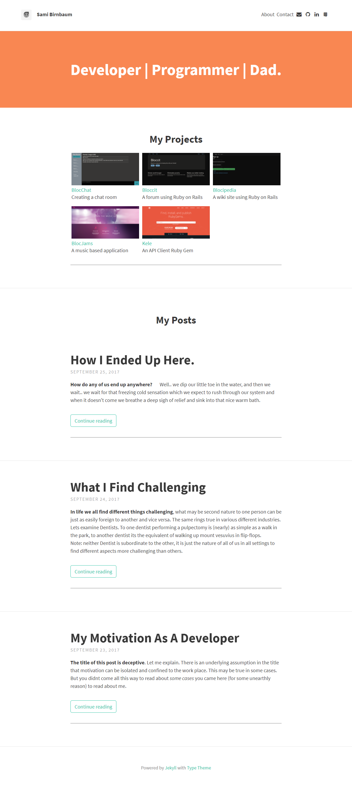

# Portfolio Iro Theme
## Based on Type Theme

[Visit Site](https://samibirnbaum.com)

A free and open-source [Jekyll](http://jekyllrb.com) theme. Great for blogs and easy to customize.

## Usage

1. Fork and clone the repo: `git clone https://github.com/samibirnbaum/samibirnbaum.github.io.git`
2. You must have Ruby installed
3. Install Jekyll: `gem install jekyll`
4. Install the theme's dependencies: `bundle install`
5. Customize the site - [Further Guidance](https://github.com/rohanchandra/type-theme)
6. Run the Jekyll server: `jekyll serve`

## License
The MIT License (MIT)
