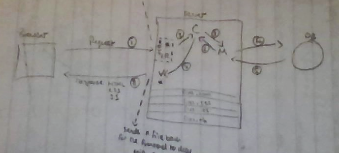

[Visit the Site](https://polar-brushlands-91836.herokuapp.com/){:target="_blank"}<br>
[Source Code on Git Hub](https://github.com/samibirnbaum/bloccit){:target="_blank"}
<hr color="gray">


<!-- CASE STUDY HERE -->
<!-- Summary -->
### Summary
<!--    - short and to the point -->
<!--    - starting point >>> outcome -->
My first ever build of an application using Ruby on Rails.

Welcome to Bloccit, a [Reddit](https://www.reddit.com/){:target="_blank"} type application where people can post, vote, favorite and comment. 

Ruby was the second programming language I learnt following JavaScript and the Ruby on Rails framework was my introduction to web development on the backend.

<!--tech used-->
##### &nbsp;&nbsp;&nbsp;&nbsp;&nbsp;&nbsp; Spec:
&nbsp;&nbsp;&nbsp;&nbsp;&nbsp;&nbsp; HTML(5) <br>
&nbsp;&nbsp;&nbsp;&nbsp;&nbsp;&nbsp; CSS(3) <br>
&nbsp;&nbsp;&nbsp;&nbsp;&nbsp;&nbsp; Bootstrap <br>
&nbsp;&nbsp;&nbsp;&nbsp;&nbsp;&nbsp; JavaScript <br>
&nbsp;&nbsp;&nbsp;&nbsp;&nbsp;&nbsp; JQuery <br>
&nbsp;&nbsp;&nbsp;&nbsp;&nbsp;&nbsp; Ruby <br>
&nbsp;&nbsp;&nbsp;&nbsp;&nbsp;&nbsp; Ruby on Rails <br>
&nbsp;&nbsp;&nbsp;&nbsp;&nbsp;&nbsp; ERB <br>
&nbsp;&nbsp;&nbsp;&nbsp;&nbsp;&nbsp; RSpec <br>
&nbsp;&nbsp;&nbsp;&nbsp;&nbsp;&nbsp; Git & Git Hub <br>
&nbsp;&nbsp;&nbsp;&nbsp;&nbsp;&nbsp; [Heroku](https://www.heroku.com/){:target="_blank"}

**This is not supposed to be a  finished product** but was part of the learning process of my web development course with [Bloc](https://www.bloc.io/){:target="_blank"} covering core programming topics.
<hr color="gray">


<!-- my role  -->
### My Role
<!--    - backstory, who and why? -->
To create this application as a sole developer, working remotely, completing specific tasks outlined by Bloc.

<!--    - explanation / relationship you had to the project -->
It was time to delve into the world of backend development. Become more familiar with servers, databases, MVC<sup id="a1">[1](#MVC)</sup>, routes and HTTP requests. And overall develop a far more holistic understanding of web applications.

Given my desire get to the bottom of things and understand the inner workings, I found this rather enjoyable, being able to trace and direct a users request all the way from the frontend through to the backend and back out to the frontend again.

On top of the above I was expected to implement TDD<sup id="a2">[2](#TDD)</sup> using RSpec.

I used Git to maintain a local repository of the project and a remote repository on GitHub, and used feature branches to ensure a smooth workflow and secure version control.

Lastly, I was asked to deploy my application on [Heroku](https://www.heroku.com/){:target="_blank"} using their CLI, enhancing my knowledge of Hosting, DNS and Domain Names. 
<hr color="gray">


<!-- Problems -->

### Problems
<!--    - problems you were hired to solve -->
Building an application from scratch meant their were numerous tasks and problems that needed to be solved. Given the limited scope of this work I will attempt to name a few to give you an insight into the generic challenges faced and my approach to them.

<!-- list 3 -->
1. &nbsp;Bloccit users will need to be able to _post_ information and _comment_ on those posts. Posts and comments will need to persist; that is, they'll need to be saved to a database so users can interact with them across sessions.  <br/><br/>
<!--    - -->
2. &nbsp;Seed a Ruby on Rails application with test data.<br/><br/>
<!----->
3. &nbsp;Complete the post resource. This includes the views, the controller and the routes.<br/>
<hr color="gray">


<!-- Solutions -->
<br>
### Solutions
<!--    - -->
1. &nbsp;Time to get to grips with the M in MVC<sup id="a1">[1](#MVC)</sup> and the way Ruby on Rails handles databases.


The first model I created is `Post`. Users should have the ability to submit posts to Bloccit with titles and descriptions, so the Post model and its corresponding database table will need two attributes: `title` and `body`.

`$ rails generate model Post title:string body:text`

In rails this produced three important files. The model itself as a Ruby class `post.rb`. The RSpec file for testing `post_spec.rb` and a migration file `20150606010447_create_posts.rb`; the set on instructions for building the databse.

I then created the `Comment` model in the same way, only with two attributes. `body` and `post_id`. This last attribute on the Comment model allowed me to create an association in the database between Posts and Comments. Given that a post could have many comments, it made sense to store a foreign key (the id for the post that the comment was writte on) inside the row of each comment in the database.

&nbsp;&nbsp;&nbsp;&nbsp;&nbsp;&nbsp;&nbsp;&nbsp;&nbsp;&nbsp;&nbsp;&nbsp;&nbsp;&nbsp;&nbsp;&nbsp;&nbsp;&nbsp;&nbsp;&nbsp;&nbsp;&nbsp;&nbsp;&nbsp;&nbsp;&nbsp;&nbsp;&nbsp;&nbsp;&nbsp;&nbsp;&nbsp;&nbsp;&nbsp;&nbsp;&nbsp;&nbsp;&nbsp;&nbsp;&nbsp;&nbsp;&nbsp;&nbsp;&nbsp;&nbsp;&nbsp;&nbsp;&nbsp;&nbsp;&nbsp;&nbsp;&nbsp;&nbsp;&nbsp;

With the models set up and the database structured, I could continue to set about developing the frontend to allow users to submit posts and comments knowing that they would persist in the database. 

Note: two things I found really helpful for database visualisation [DB Browser for SQLite](http://sqlitebrowser.org/){:target="_blank"} and the Ruby Gem [rails-erd](https://github.com/voormedia/rails-erd){:target="_blank"}.
<br/><br/>
<!--    - -->
2\. &nbsp;Populating your application with test data is a helpful way to spot bugs in development. This test data will consist of script-generated fake posts and comments, added to the development database only.

In future projects I utilised a Ruby Gem called [Faker](https://rubygems.org/gems/faker){:target="_blank"} to create the fake data, but given this was my first Ruby on Rails application, Bloc ethos is to get you coding as much on your own as possible, so you can understand better what is going on under the hood, when you do eventually use these gems. In my opinion this type of learning is invaluable.

I first stubbed out the `seeds.rb` file to get a clear picture of how I would like the development database to be populated.


require "random_data" #requires a separate file of ruby code - often a class

50.times do
    Post.create!(
        title: RandomData.random_sentence, #use these methods on the class to create strings for our attributes
        body: RandomData.random_paragraph
    )
end

posts = Post.all #retrieves every post object from the db and stores it in variable called posts - returns array

100.times do
    Comment.create!(
        post: posts.sample, #array method to pick out random element, in this case a post object
        body: RandomData.random_paragraph
    )
end

puts "Seed finished"
puts "#{Post.count} posts created"
puts "#{Comment.count} comments created" 


Now all that was needed was to create this `RandomData` module whose methods I could use to help populate the attributes in `seeds.rb`


module RandomData
    def self.random_paragraph
        sentences = []
        rand(4..6).times do # a random number of times do
            sentences << random_sentence #some paragraphs have 4 random sentences, others 5/6
        end
        sentences.join(" ") #each sentence is a cell in array, create string
    end

    def self.random_sentence
        strings = []
        rand(3..8).times do
            strings << random_word #creates an array with between 3-8 cells of random words
        end
        sentence = strings.join("") #take each word from each cell and join into a string to make a sentence
        sentence.capitalize << "." #capitalize first letter of sentence and add a . at the end
    end

    def self.random_word
        letters = ("a".."z").to_a #[a,b,c,d,e...]
        letters.shuffle!      #[g,e,h,a,f,...]
        letters[0,rand(3..8)].join #give me letters between 0 and 3-8 and make a string from them
    end
end


I was now able to run 

`$ rails db:reset`

Which produced the following expected output:
```
Seed finished
50 posts created
100 comments created
```

Lastly, I jumped into the rails console

`$ rails c`

Allowing me to poke around the database, check were things were as expected and even sample some neat `ActiveRecord` methods.
<br/><br/>
<!-- - -->
3\. &nbsp;Completing this task would enhance my understanding of backend development, CRUD, and the inner workings of the Ruby on Rails framework.

I first generated the controller and the views with the following command:

`$ rails generate controller Posts index show new edit`

This created a Posts controller with four actions or methods, `index`, `show`, `new` and `edit`. It also created views for each action, routes and an RSpec file for the controller. All of these would be neccessary for building the Posts resource.

A quick look at the routes helped me to build a clear picture of how the users would reach my action inside the controller on the backend.

```
$ rails routes

   Prefix Verb   URI Pattern               Controller#Action
    posts GET    /posts(.:format)          posts#index
          POST   /posts(.:format)          posts#create
 new_post GET    /posts/new(.:format)      posts#new
edit_post GET    /posts/:id/edit(.:format) posts#edit
     post GET    /posts/:id(.:format)      posts#show
          PATCH  /posts/:id(.:format)      posts#update
          PUT    /posts/:id(.:format)      posts#update
          DELETE /posts/:id(.:format)      posts#destroy
    about GET    /about(.:format)          welcome#about
     root GET    /                         welcome#index
```

The initial focus would be on the index action which the user would activate with this route:

```
posts GET    /posts(.:format)          posts#index
```

Maintaining the principles of TDD I first wrote my tests for the `index` action:


require 'rails_helper'

RSpec.describe PostsController, type: :controller do

  #I have access to the post model to create a new post object and save to the db
  let(:my_post) { Post.create!(title: RandomData.random_sentence, body: RandomData.random_paragraph) }

  describe "GET #index" do
    it "returns http success" do
      get :index
      expect(response).to have_http_status(:success)
    end

    it "assigns [my_post] to @posts" do #if we call the post/index url - the controller should automatically assign all posts to @posts IV
      get :index
      expect(assigns(:posts)).to eq([my_post]) #assigns to IV on route call, and array with one post in
    end
  end
end


Rails actions have automatic rendering built-in, which allowed for a straightforward simple `index` action: 


def index
    @posts = Post.all #returns array from db of all post objects
end


Lastly, I utilised this Instance Variable `@posts` using `ERB` on the frontend to display the posts:


<h1>Posts HomePage!! - All Posts</h1>
<%@posts.each do |post| %>
    <div class="media">
        <div class="media-body">
            <h4 class="media-heading">
                <%= link_to(post.title, post_path(post.id)) %> <!--an anchor tag, text is post.title and when you click it links to posts#show a path which needs a post id-->
            </h4>
        </div>
   </div>  
<% end %>



With these steps I begun to build out my post resource, which I then continued to develop.


**Note:** These were by far not the hardest problems or challenges faced when building this application, for more complex functionality please feel free to look over the [source code on Git Hub](https://github.com/samibirnbaum/bloccit){:target="_blank"}. However, the idea is that you can get a feel for some of the problems and my systematic approach to them.
<br/><br/>
<!--    - -->
<hr color="gray">


<!-- Results -->

### Results
<!--    - how you tested -->
My main form of testing for my rails application was using RSpec. This helped me to catch any bugs far quicker and meant I didnt need to be overly concerned when refactoring my code or changing other features in the application. I also tested things using `IRB` and the `rails console`.
<!--    - did you get desired outcome -->

I was able to achieve the desired outcomes of the course project and more importantly I was really able to develop a solid foundation of understanding in Ruby on Rails and all the accompanying technologies, RVM, RSpec, servers, HTTP Requests, etc... 
<br/><br/>
<!--    - others reviews -->
Feedback from my codementor was positive.
<hr color="gray">


<!-- Conclusion -->

### Conclusion
<!--    - What were your doubts going into the project? -->
Initially I was concerened about the lack of visualisation when embarking on a backend project. This kind of myth that everything is happening somewhere out there behind the scenes and it will be hard to make sense of or track.
<!--    - What surprised you the most? -->

The truth could not have been more different. On the contrary, I felt that there was far more clarity and understanding of an application when working on it from the backend. It gave me a complete birds eye view of the project, allowing me to understand and juggle different pieces of the application.<br><br>

&nbsp;&nbsp;&nbsp;&nbsp;&nbsp;&nbsp;&nbsp;&nbsp;&nbsp;&nbsp;&nbsp;&nbsp;&nbsp;&nbsp;&nbsp;&nbsp;<br>
&nbsp;&nbsp;&nbsp;&nbsp;&nbsp;&nbsp;&nbsp;&nbsp;&nbsp;&nbsp;&nbsp;&nbsp;&nbsp;&nbsp;&nbsp;&nbsp;&nbsp;&nbsp;&nbsp;&nbsp;&nbsp;&nbsp;&nbsp;&nbsp;&nbsp;&nbsp;&nbsp;&nbsp;&nbsp;&nbsp;&nbsp;&nbsp;&nbsp;&nbsp;&nbsp;&nbsp;&nbsp;&nbsp;&nbsp;&nbsp;&nbsp;&nbsp;&nbsp;&nbsp;&nbsp;&nbsp;&nbsp;&nbsp;&nbsp;&nbsp;&nbsp;&nbsp;&nbsp;&nbsp;&nbsp;&nbsp;&nbsp;&nbsp;&nbsp;&nbsp;&nbsp;&nbsp;&nbsp;&nbsp;&nbsp;&nbsp;*My birds eye view*

<!--    - What would you have done differently? -->
<br>
Arguably, I could have utilised many more Ruby Gems to produce certain features and functionality for Bloccit. However, being forced to create my own random data, authorisation and authentication for users, really helped me in understanding how these things work under the hood. As a result of this, in the future when I went on to use gems such as [Faker](https://rubygems.org/gems/faker){:target="_blank"} and [Devise](https://rubygems.org/gems/devise){:target="_blank"}, this helped immensely. 

<!--    - What did you learn while doing this project? -->
The biggest and most valuable learning curve whilst undertaking this project, was to really be able to build a working diagram of how the internet works.<br><br>

&nbsp;&nbsp;&nbsp;&nbsp;&nbsp;&nbsp;&nbsp;&nbsp;&nbsp;&nbsp;<br>
&nbsp;&nbsp;&nbsp;&nbsp;&nbsp;&nbsp;&nbsp;&nbsp;&nbsp;&nbsp;&nbsp;&nbsp;&nbsp;&nbsp;&nbsp;&nbsp;&nbsp;&nbsp;&nbsp;&nbsp;&nbsp;&nbsp;&nbsp;&nbsp;&nbsp;&nbsp;&nbsp;&nbsp;&nbsp;&nbsp;&nbsp;&nbsp;&nbsp;&nbsp;&nbsp;&nbsp;&nbsp;&nbsp;&nbsp;&nbsp;&nbsp;&nbsp;&nbsp;&nbsp;&nbsp;&nbsp;&nbsp;&nbsp;&nbsp;&nbsp;&nbsp;&nbsp;&nbsp;&nbsp;&nbsp;&nbsp;&nbsp;&nbsp;&nbsp;&nbsp;*Yes I actually drew this myself*
<br><br>
To pull all the pieces together that until now had sometimes seemed disparate or incoceivable. This level of comprehension, although still developing, not only helped me on the backend but also with all the coding on the frontend. 

<!--    - How will you use that information in the future? -->
Going forward, this ability to visualise the bigger picture, will not only to help me write better code but also help me to understand what part of the life cycle of my application my code is influencing.


<br><br><br><br><br><br><br>
<hr color="gray">
<a name="MVC">1</a>: The Model-View-Controller (MVC) is an architectural pattern that separates an application into three main logical components: the model, the view, and the controller. Each of these components are built to handle specific development aspects of an application.[↩](#a1)

<a name="TDD">2</a>: Test-driven development (TDD) is a development technique where you must first write a test that fails before you write new functional code.[↩](#a2)


*[CLI]: Command Line Interface
*[CRUD]: Create Read Update Delete


<!-- Code Blocks: -->







