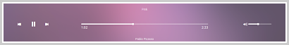

[Source Code on Git Hub](https://github.com/samibirnbaum/bloc-jams){:target="_blank"}

<!-- CASE STUDY HERE -->
<!-- Summary -->
### Summary
<!--    - short and to the point -->
<!--    - starting point >>> outcome -->
My first ever build of an application from scratch.

Welcome to Bloc Jams, a digital music player like Spotify that I built to learn frontend web development.

##### &nbsp;&nbsp;&nbsp;&nbsp;&nbsp;&nbsp; Spec:
&nbsp;&nbsp;&nbsp;&nbsp;&nbsp;&nbsp; HTML(5)  
&nbsp;&nbsp;&nbsp;&nbsp;&nbsp;&nbsp; CSS(3)  
&nbsp;&nbsp;&nbsp;&nbsp;&nbsp;&nbsp; JavaScript  
&nbsp;&nbsp;&nbsp;&nbsp;&nbsp;&nbsp; JQuery  
&nbsp;&nbsp;&nbsp;&nbsp;&nbsp;&nbsp; AngularJS  
&nbsp;&nbsp;&nbsp;&nbsp;&nbsp;&nbsp; Git & Git Hub  
&nbsp;&nbsp;&nbsp;&nbsp;&nbsp;&nbsp; [Buzz Library](http://buzz.jaysalvat.com/){:target="_blank"}  
&nbsp;&nbsp;&nbsp;&nbsp;&nbsp;&nbsp; [Ionicons](http://ionicons.com/){:target="_blank"}  
&nbsp;&nbsp;&nbsp;&nbsp;&nbsp;&nbsp; [Netlify](https://www.netlify.com/){:target="_blank"}

**This is not supposed to be a  finished product** but was part of the learning process of my web development course with [Bloc](https://www.bloc.io/){:target="_blank"} covering core programming topics.

<!-- my role  -->
### My Role
<!--    - backstory, who and why? -->
To create this application as a sole developer, working remotely, completing specific tasks outlined by Bloc.

<!--    - explanation / relationship you had to the project -->
It was time for me to be thrown into the deep end! Use HTML(5) to build up the content of the application, CSS(3) to style that content for a sleek UI appearance and JavaScript to create attractive dynamic functionality.

Implement two JavaScript libraries: JQuery, and [Buzz](http://buzz.jaysalvat.com/){:target="_blank"} to manage sounds.

Use Git to maintain a local repository of the project and a remote repository on GitHub, and use feature branches to ensure a smooth workflow and secure version control.

Lastly, deploy my application, enhancing my knowledge of Hosting, DNS and Domain Names. 

<!-- Problem -->

### Problems
<!--    - problems you were hired to solve -->
Some of the many ~~problems~~ challenges faced in building this application.

<!--    - -->
1. &nbsp;Refactor standard HTML to meet HTML5 semantic requirements.   
<!--    - -->
2. &nbsp;A neat little feature -  Implement a music player bar that will (eventually with JavaScript 
&nbsp;&nbsp;&nbsp;&nbsp;&nbsp;&nbsp;programming) allow users to pause and play songs, view and adjust playback progress, and 
&nbsp;&nbsp;&nbsp;&nbsp;&nbsp;&nbsp;adjust volume, using a combination of HTML and CSS.
 
&nbsp;&nbsp;&nbsp;&nbsp;&nbsp;&nbsp;
  
<!--    - list reasons (before screenshots) -->
3. &nbsp;Achieve Responsive Web Development - ensure that the appplication looks beautiful on all 
&nbsp;&nbsp;&nbsp;&nbsp;&nbsp;&nbsp;different size screens from wide screen tv's to laptops to mobiles.
  
<!--    - -->
4. &nbsp;Include JQuery in your application, refactor vanilla javascript DOM scripting, reap the rewards.
  
<!--    - -->
5. &nbsp;Refactor the whole app to use the frontend framework AngularJS

<!-- Solution -->

### Solutions
<!--    - -->
1. &nbsp;This was not a challenging task, however, becoming familiar with new doccumentation
&nbsp;&nbsp;&nbsp;&nbsp;&nbsp;&nbsp;relating to upgraded web tehnologies is a critical skill in the ever-changing web tech world we 
&nbsp;&nbsp;&nbsp;&nbsp;&nbsp;&nbsp;live in.  
&nbsp;&nbsp;&nbsp;&nbsp;&nbsp;&nbsp;Consequently, I consulted MDN Documentation on HTML5 and refactored the original code. In 
&nbsp;&nbsp;&nbsp;&nbsp;&nbsp;&nbsp;this instance changing `
` tags to their corresponding HTML5 `<nav>` and `<section>` tags.
  
<!--    - -->
2. &nbsp;In order to break the task down and keep things nice and organised I created three "control 
&nbsp;&nbsp;&nbsp;&nbsp;&nbsp;&nbsp;groups":
 
    * Main controls, which contains the play/pause and previous/next buttons.
    * Currently playing, which displays the currently playing song information, including the song 
    &nbsp;&nbsp;&nbsp;&nbsp;&nbsp;&nbsp; progress.
    * Volume, which contains the volume control slider.
 

<section class="player-bar">
    

        

        

        

        

        

        

    

</section> 

After developing clear and concise HTML I moved on to the CSS creating a user friendly bar using [ionicons](http://ionicons.com/){:target="_blank"}.
  
One of the trickier parts was building the song progress and volume bars ("seek bars"):


 <!--the base transparent progress bar -->
    

 <!-- the more opaque colour that fills the seek bar to display progress -->
    

 <!-- the prominent circle at the end of the fill to improve UX -->


But using some advanced CSS I was able to achieve the desired look

 .seek-bar {
     height: 0.25rem;
     background-color: rgba(255, 255, 255, 0.3);
     border-radius: 2px;
     position: relative;
     cursor: pointer;
 }
 
 .seek-bar .fill {
     background-color: white;
     width: 36%;
     height: 0.25rem;
     border-radius: 2px;
 }
 
 .seek-bar .thumb {
     position: absolute;
     height: 0.5rem;
     width: 0.5rem;
     background-color: white;
     left: 36%;
     top: 50%;
     margin-left: -0.25rem;
     margin-top: -0.25rem;
     border-radius: 50%;
     cursor: pointer;
     -webkit-transition: all 100ms ease-in-out;
        -moz-transition: all 100ms ease-in-out;
             transition: all 100ms ease-in-out;
 }
 
 .seek-bar:hover .thumb {
     width: 1.1rem;
     height: 1.1rem;
     margin-top: -0.5rem;
     margin-left: -0.5rem;
 }

Lastly, the music player bar was to remain at the botttom of the users view of the screen at all times. This allowed for easy and smooth control of the music playing, without having to scroll all the way to the bottom of the entire page each time.
  
This was achieved using CSS:

 .player-bar {
     position: fixed;
     bottom: 0;
     left: 0;
     right: 0;
     height: 200px;
     background-color: rgba(255, 255, 255, 0.3);
     z-index: 100;
 }

  
<!--    - list (after screenshots / code snippers) -->
3\. &nbsp; The most basic starting point was to set the viewport meta tag.

 <meta name="viewport" content="width=device-width, initial-scale=1">

 &nbsp;  &nbsp; &nbsp; &nbsp; This meant that the page now scaled to fit the width of the users device.

 &nbsp;  &nbsp; &nbsp; &nbsp; However, things still didnt look quite right...

 &nbsp;  &nbsp; &nbsp; &nbsp;&nbsp;  &nbsp; &nbsp; &nbsp;&nbsp;  &nbsp; &nbsp; &nbsp;&nbsp;  &nbsp; &nbsp; &nbsp; 

 &nbsp;  &nbsp; &nbsp; &nbsp; The three `divs` at the bottom of the page were aligned next to each other using `display:`&nbsp;  &nbsp; &nbsp; &nbsp; &nbsp;  &nbsp; &nbsp; &nbsp; `table-cell;` each with a `width: 33.3%;`, however to prevent the user from having to 
 &nbsp;  &nbsp; &nbsp; &nbsp; &nbsp;&nbsp;  &nbsp; &nbsp;&nbsp; scroll left or right on smaller screens, ideally, it would be great to have them break out of this 
 &nbsp;  &nbsp; &nbsp; &nbsp; &nbsp; fixed table and stack on top of each other for smaller devices.

<!--The three divs-->
 <section class="selling-points">
    

        
        <h5 class="point-title">Choose your music</h5>
        
The world is full of music; why should you have to listen to music that someone else chose?

    

    

        
        <h5 class="point-title">Unlimited, streaming, ad-free</h5>
        
No arbitrary limits. No distractions.

    

    

        
        <h5 class="point-title">Mobile enabled</h5>
        
Listen to your music on the go. This streaming service is available on all mobile platforms.

    

</section>


&nbsp;  &nbsp; &nbsp; &nbsp; Say hello to Media Queries.

&nbsp;  &nbsp; &nbsp; &nbsp; I created my own grid system which would align the `divs` next to each other whilst being 
&nbsp;  &nbsp; &nbsp; &nbsp;&nbsp;&nbsp;  &nbsp; &nbsp;&nbsp;&nbsp;&nbsp;&nbsp; viewed on a medium size screen. If the viewport dropped below the size of a medium screen, 
&nbsp;&nbsp;&nbsp;&nbsp;&nbsp;&nbsp;&nbsp;&nbsp;I would use media queries to turn my grid system off, allowing the `divs` to fall back into the 
&nbsp;&nbsp;&nbsp;&nbsp;&nbsp;&nbsp;&nbsp;&nbsp;'normal flow' of the doccument and stack on top of each other.

 @media (min-width: 640px) {
     html { font-size: 112%; }

     .column {
         float: left;
         padding-left: 1rem;
         padding-right: 1rem;
     }
 
     .column.full { width: 100%; }
     .column.two-thirds { width: 66.7%; }
     .column.half { width: 50%; }
     .column.third { width: 33.3%; }
     .column.fourth { width: 25%; }
     .column.flow-opposite { float: right; }
 }

  
<!--    - -->
4\. &nbsp; I used a CDN to pull the JQuery library into my app.




Now I was able to evolve from using DOM selectors to JQuery selectors.

This gave me better cross browser support and allowed me to use CSS-style syntax. Overall, this enabled my coding to be more efficent and run more smoothly.

**Time to refactor some of my JavaScript:**

Do you remember those three `divs` we made responsive above, how cool if we could make those animated!

//THE ORIGINAL VANILLA JAVASCRIPT
window.onload = function() {

    // Automatically animates the points on a tall screen where scrolling can't trigger the animation
    if (window.innerHeight > 950) {
        animatePoints(pointsArray);
    }
    
    //Animate the points when user scrolls to them
    var sellingPoints = document.getElementsByClassName('selling-points')[0];
    var scrollDistance = sellingPoints.getBoundingClientRect().top - window.innerHeight + 200;

    window.addEventListener("scroll", function(event) {
        if (document.documentElement.scrollTop || document.body.scrollTop >= scrollDistance) {
            animatePoints(pointsArray);
        }
    });
}


And now using the power of JQuery:

//USING JQUERY
$(window).load(function() {

    // Automatically animates the points on a tall screen where scrolling can't trigger the animation
    if ($(window).height() > 950) {
         animatePoints();
    }
    
    //Animate the points when user scrolls to them
    var scrollDistance = $('.selling-points').offset().top - $(window).height() + 200;

    $(window).scroll(function(event) {
        if ($(window).scrollTop() >= scrollDistance) {
            animatePoints();
        }
    });
});


Refactoring my code (like the example above) using JQuery selectors as well as methods from the JQuery library allowed my coding and my app to become far more efficient.
  
<!--    - -->
5\. &nbsp; I would be lying if I didn't say that this task was very hard and arduous at times. It meant taking the app I had written using vanilla Javascript and JQuery, and writing it again using a JavaScript framework, which had its own rules for frontend implementation, including an MVC architectual design. Moreover, AngularJS has quite a steep learning curve with a fair bit of new terminology.

However, tackling this learning curve would allow my app to utilise some of angulars core features such as two-way data binding and single page application design.

It is not possible to include everything I did here, but by way of example lets take a look at how I transformed BlocJams into a single page application.

**Creating the Templates:**

`index.html` would act as the global file for Bloc Jams. It would be the page that the user would navigate to, and all other data to be displayed to the user would simply be rendered on this page, without the browser navigating to a separate page.

To implement this we added `<ui-view></ui-view>` tags to `index.html` 

 ...
 <body>
     <nav class="navbar">
         ... <!--ellipsis indicates existence of other code left our for brevity-->
     </nav>

     <ui-view></ui-view>

     
     
 </body>
 </html>


Views to be rendered in the global file were created in the `app/templates` directory.
* `bloc-jams-angular/app/templates/landing.html`
* `bloc-jams-angular/app/templates/collection.html`
* `bloc-jams-angular/app/templates/album.html`

**Creating the Routes:**

To display these templates in the view, Angular uses routing, which is organized around URL routes. Angular has a built-in router, but Bloc advised that many developers don't use it.

Instead, we were advised use [UI-Router](https://ui-router.github.io/){:target="_blank"} because it is more flexible and features behaviors not found in the Angular tools.

Using dependency injection UI-Router was injected into the apps root module.


angular.module('blocJams', ['ui.router']);


Time to configure paths and states:


(function(){
    function config ($stateProvider, $locationProvider) {  /*configuring default behaviour of a module with providers*/
        $locationProvider /*SET properties on the location object*/
            .html5Mode({
                enabled: true, /*disables hashbang url when user changes location*/
                requireBase: false            
            });
        $stateProvider /*SET default settings for the state*/ /*manipulate the url to load in a template*/
            .state("landing", { /*name of the state*/
                url: "/",       /*its url in the browser*/
                controller: "LandingCtrl as landing",
                templateUrl: "/templates/landing.html" /*for this landing state, this is the template html*/
            })
            .state("album", {
                url: "/album",
                controller: "AlbumCtrl as album",
                templateUrl: "/templates/album.html"
            })
            .state("collection", {
                url: "/collection",
                controller: "CollectionCtrl as collection",
                templateUrl: "/templates/collection.html"
            });
    }
    
    angular
        .module("blocJams", ["ui.router"])
        .config(config); /*our providers (configuration) added to the root module here*/

})();


Although, the configuration was very involved, once set up, this transformed BlocJams into an SPA.

In order to trigger a state UI-Router provided this tag `<a ui-sref="album">`.

<!-- Results -->

### Results
<!--    - how you tested -->
Given this application was only using front-end web technologies. I had two options for testing, either setting up a local server or simply opening my files in the browser itself. I opted for the latter as this met my needs and was quicker to implement.
  
Juidicious use of the DOM within google chromes development tool allowed for thorough testing, catching any mistakes or bugs, fixing and then re-testing again.
  
<!--    - did you get desired outcome -->
I was able to achieve the desired outcomes of the course project. However, given this was only for learning purposes there are naturally things that were not required, which in time I would like to implement or complete.
  
<!--    - others reviews -->
Feedback from my codementor was positive.

<!-- Conclusion -->

### Conclusion
<!--    - What were your doubts going into the project? -->
Going into my first ever project I was excited but naturally I had doubts, I was being thrown into the deep end, being asked to use high-tech skills to problem solve some tricky tasks and ultimatley produce a working application.
  
<!--    - What surprised you the most? -->
What surprised me the most was actually the amount of good, solid, well written code that is needed to produce a high quality application. However, more importantly, how code efficency from the beggining as well as using the right helper libraries can significantly increase efficiency.
  
<!--    - What would you have done differently? -->
<!--    - What did you learn while doing this project? -->
Perhaps one of the most important things I learnt whilst doing this project, beyond the inherent skills themselves, was actually the resources that I could turn to when I felt like I had hit a brick wall.
  
Becoming familar with asking the right questions and communicating with others over [slack](https://slack.com/){:target="_blank"} or resoursces like [stack overflow](https://stackoverflow.com/){:target="_blank"} proved incredibly helpful, when sometimes it takes someone else to see or problem solve from a different angle than you have been pursuing.
  
<!--    - How will you use that information in the future? -->
Going forward, this learning curve, I am sure, will prove its worth, as being able to utilise and engage with the wider coding community can make (almost) any problem, challenge or task achievable.