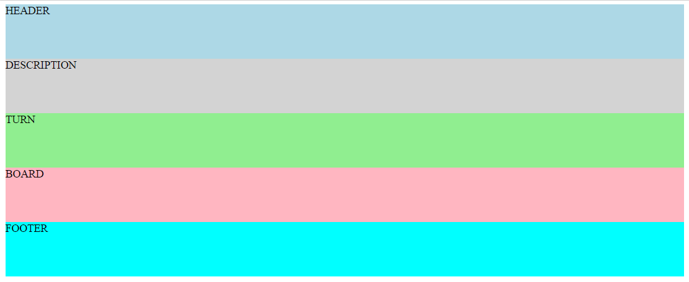
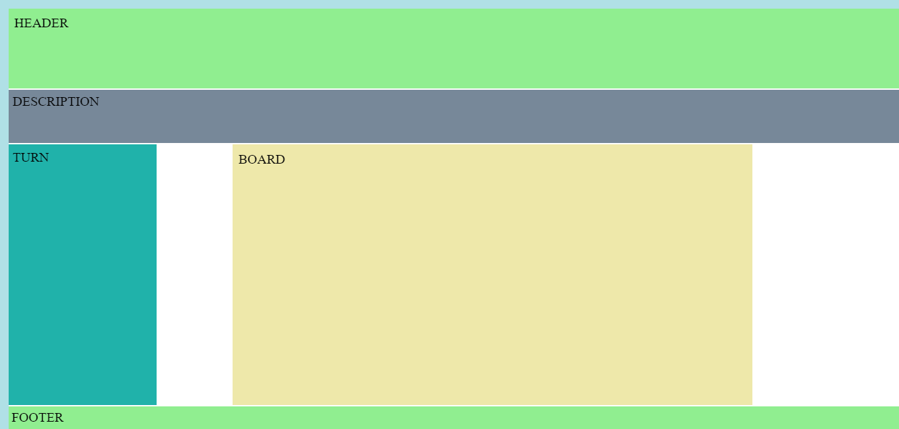
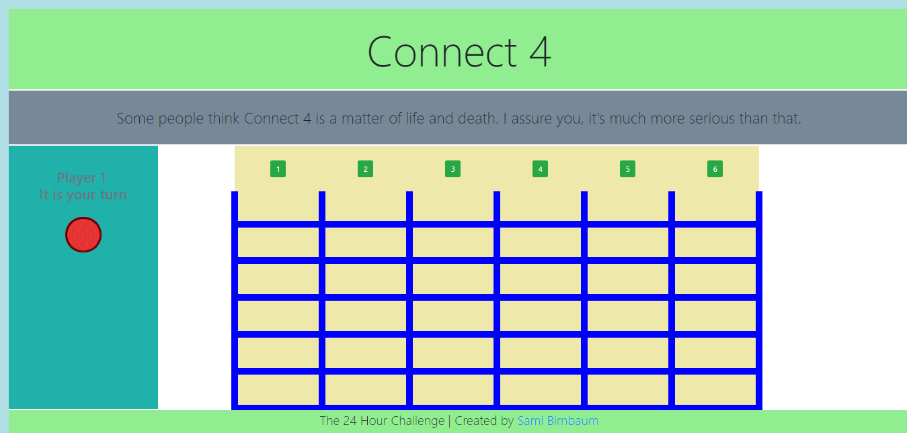
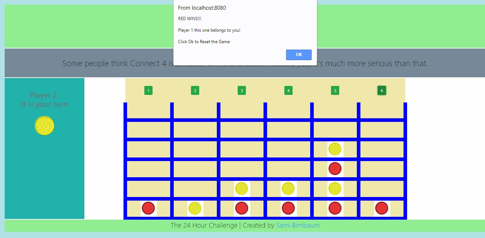

[Visit the Site](https://evening-lowlands-83392.herokuapp.com/){:target="_blank"} 
[Source Code on Git Hub](https://github.com/samibirnbaum/connect-4.git){:target="_blank"}

<!-- CASE STUDY HERE -->
<!-- Summary -->
### Summary
<!--    - short and to the point -->
<!--    - starting point >>> outcome -->
The 24 hour challenge.

Build a game of connect 4 within 24 hours.

<!--tech used-->
##### &nbsp;&nbsp;&nbsp;&nbsp;&nbsp;&nbsp; Spec:
&nbsp;&nbsp;&nbsp;&nbsp;&nbsp;&nbsp; HTML(5)  
&nbsp;&nbsp;&nbsp;&nbsp;&nbsp;&nbsp; CSS(3)  
&nbsp;&nbsp;&nbsp;&nbsp;&nbsp;&nbsp; [CSS Grid](https://developer.mozilla.org/en-US/docs/Web/CSS/CSS_Grid_Layout){:target="_blank"}  
&nbsp;&nbsp;&nbsp;&nbsp;&nbsp;&nbsp; Bootstrap  
&nbsp;&nbsp;&nbsp;&nbsp;&nbsp;&nbsp; JavaScript  
&nbsp;&nbsp;&nbsp;&nbsp;&nbsp;&nbsp; JQuery  
&nbsp;&nbsp;&nbsp;&nbsp;&nbsp;&nbsp; [NPM](https://www.npmjs.com/){:target="_blank"}  
&nbsp;&nbsp;&nbsp;&nbsp;&nbsp;&nbsp; Git & Git Hub  
&nbsp;&nbsp;&nbsp;&nbsp;&nbsp;&nbsp; [Heroku](https://www.heroku.com/){:target="_blank"}

<!-- my role  -->
### My Role
<!--    - backstory, who and why? -->
To create this application as a sole developer, working remotely, within the given time frame.

<!--    - explanation / relationship you had to the project -->
Time was of the essence, but failing to plan is planning to fail. I needed to visualise the task ahead, so I created a Wireframe [1](#Wireframes) to give me a picture of the end product. As well as this, I created User Stories [2](#UserStories) that helped to break down the tasks, but also keep me on track.

I divided the User Stories into two categories, essential and desirable. This ensured I would complete what was essential to the general functionality first, before getting lost on something more peripheral. I also rated each User Story with a difficulty rating to give me an idea of the length I could expect to take on completing each one. 

Essential:
* As a user, I want to see an empty board with multiple play buttons
* As a user, I want to see whose turn it is and their color, after every turn this should change to 
&nbsp;&nbsp;&nbsp;&nbsp;&nbsp;&nbsp;&nbsp;reflect the current player and their color
* As a user, when I click the play button I should see my piece fall into the correct area	
* As a user, when someone gets 4 in a row, the game should stop, notify the winner and reset 
&nbsp;&nbsp;&nbsp;&nbsp;&nbsp;&nbsp;&nbsp;itself for another game

Desirable:
* As a user, I would like sound affects for the game play
* As a user, I would like a total score keeper
* As a user, I would like an enhanced UX

I decided to use [NPM](https://www.npmjs.com/){:target="_blank"} as a way to manage my frontend dependencies and also to give me access to any helpful 3rd party libraries I may have come across.

I used Git to maintain a local repository of the project and a remote repository on GitHub.

Lastly, I decided to deploy my application on [Heroku](https://www.heroku.com/){:target="_blank"} using their CLI, to further enhance my knowledge of Hosting, DNS and Domain Names. 

<!-- Problems -->

### Problems
<!--    - problems you were hired to solve -->
Building an application of this nature from scratch meant there were numerous tasks and problems that needed to be solved. Given the limited scope of this work I will attempt to name a few to give you an insight into the generic challenges faced and my approach to them.

<!-- list 3 -->
1. &nbsp;Create the HTML for the view and position elements using CSS.    
<!--    - -->
2. &nbsp;After the User clicks a play button have the piece fall into the correct slot in that row.  
<!----->
3. &nbsp;Somehow detect if there are 4 of one color in a row and notify the users of a winner. 

<!-- Solutions -->
 
### Solutions
<!--    - -->
1. &nbsp; Thanks to my Wireframe, I had a good idea of what I wanted to achieve. The challenge was to achieve that using HTML and CSS. 

Given these are both not actual programming languages I believe people actually underestimate the level of understanding and skill required to use both these technologies.

I stubbed out the elements I would need to achieve the look of the landing page

...
<section class="container">
    <header>HEADER</header>
    <section class="description">DESCRIPTION</section>
    <main class="game-area">
        
TURN

        
BOARD

    </main>
    <footer>FOOTER</footer>
</section>
...


That was easy enough, but currently they simply remained in the normal flow of the page, stacked on top of each other and consuming the entire width of the view.

Normally, I would have gone straight to bootstrap to utilise their grid but I was keen to learn something new and find something better. Welcome [CSS Grid!](https://developer.mozilla.org/en-US/docs/Web/CSS/CSS_Grid_Layout){:target="_blank"}


.container-mine {
    background-color: white;
    display: grid;
    grid-gap: 3px;
    grid-template-columns: repeat(12, 1fr);
    grid-template-rows:  180px 120px 90px 80px 80px 80px 80px 80px 80px 50px;
    grid-template-areas: 
        "h h h h h h h h h h h h"
        "d d d d d d d d d d d d"
        "t t . b b b b b b b . ."
        "t t . b b b b b b b . ." 
        "t t . b b b b b b b . ."
        "t t . b b b b b b b . ."
        "t t . b b b b b b b . ."
        "t t . b b b b b b b . ."
        "t t . b b b b b b b . ."
        "f f f f f f f f f f f f";
}


The learning curve is not too arduous and the results are truly amazing. A technology I believe, will become the go-to for positioning elements on a page.

The result:

   
<!--    - -->
2\. &nbsp; I had the view looking how I wanted, so it was now time to focus on the actual gameplay.

Everytime a user clicked one of the buttons above a row, their color piece would have to fall into the correct slot.

The game board was designed using a table.



    <table>
        <tr class="play-buttons">
            <th><button class="btn btn-success" data-button="1">1</button></th>
            <th><button class="btn btn-success" data-button="2">2</button></th> 
            <th><button class="btn btn-success" data-button="3">3</button></th>
            <th><button class="btn btn-success" data-button="4">4</button></th>
            <th><button class="btn btn-success" data-button="5">5</button></th> 
            <th><button class="btn btn-success" data-button="6">6</button></th>
        </tr>
        <tr class="firstrow">
            <th data-board-cell="1"></th>
            <th data-board-cell="2"></th> 
            <th data-board-cell="3"></th>
            <th data-board-cell="4"></th>
            <th data-board-cell="5"></th> 
            <th data-board-cell="6"></th>
        </tr>
        <tr>
            <th data-board-cell="7"></th>
            <th data-board-cell="8"></th> 
            <th data-board-cell="9"></th>
            <th data-board-cell="10"></th>
            <th data-board-cell="11"></th> 
            <th data-board-cell="12"></th>
        </tr>
        <tr>
            <th data-board-cell="13"></th>
            <th data-board-cell="14"></th> 
            <th data-board-cell="15"></th>
            <th data-board-cell="16"></th>
            <th data-board-cell="17"></th> 
            <th data-board-cell="18"></th>
        </tr>
        <tr>
            <th data-board-cell="19"></th>
            <th data-board-cell="20"></th> 
            <th data-board-cell="21"></th>
            <th data-board-cell="22"></th>
            <th data-board-cell="23"></th> 
            <th data-board-cell="24"></th>
        </tr>
        <tr>
            <th data-board-cell="25"></th>
            <th data-board-cell="26"></th> 
            <th data-board-cell="27"></th>
            <th data-board-cell="28"></th>
            <th data-board-cell="29"></th> 
            <th data-board-cell="30"></th>
        </tr>
        <tr>
            <th data-board-cell="31"></th>
            <th data-board-cell="32"></th> 
            <th data-board-cell="33"></th>
            <th data-board-cell="34"></th>
            <th data-board-cell="35"></th> 
            <th data-board-cell="36"></th>
        </tr>
    </table>



Using the HTML(5) data attribute I could give each cell in the table a number.

Now all I had to do, was based on the users click add the piece to the correct cell.

I did this by tracking the amount of clicks on each button above a row, and depending on how many times it had been clicked, that would determine which cell the playing-piece should display in.


var buttonOneClickCount = 0;
var buttonTwoClickCount = 0;
var buttonThreeClickCount = 0;
var buttonFourClickCount = 0;
var buttonFiveClickCount = 0;
var buttonSixClickCount = 0;

/****TRACK CLICKS****/
var clickTrack = function (eventTarget) {
    clickCountTotal = clickCountTotal + 1;
    
    switch ($(eventTarget).data("button")) {
        case 1:
            buttonOneClickCount = buttonOneClickCount + 1;
            break;
        case 2:
            buttonTwoClickCount = buttonTwoClickCount + 1;
            break;
        case 3:
            buttonThreeClickCount = buttonThreeClickCount + 1;
            break;
        case 4:
            buttonFourClickCount = buttonFourClickCount + 1;
            break;
        case 5:
            buttonFiveClickCount = buttonFiveClickCount + 1;
            break;
        case 6:
            buttonSixClickCount = buttonSixClickCount + 1;
    };
};
/*********************************/

/****PLACING PIECES ON THE BOARD****/

var placePiece = function(eventTarget) {
    if($(eventTarget).data("button") === 1 && buttonOneClickCount === 1){
        currentPlacedCell = 31;
        insertPiece(currentPlacedCell, currentPieceColor);
        updateTheBoard(currentPlacedCell, currentPieceColor);
    }else if($(eventTarget).data("button") === 1 && buttonOneClickCount === 2){
        currentPlacedCell = 25;
        insertPiece(currentPlacedCell, currentPieceColor);
        updateTheBoard(currentPlacedCell, currentPieceColor);
    }else if($(eventTarget).data("button") === 1 && buttonOneClickCount === 3){
        currentPlacedCell = 19;
        insertPiece(currentPlacedCell, currentPieceColor);
        updateTheBoard(currentPlacedCell, currentPieceColor);
    }else if($(eventTarget).data("button") === 1 && buttonOneClickCount === 4){
        currentPlacedCell = 13;
        insertPiece(currentPlacedCell, currentPieceColor);
        updateTheBoard(currentPlacedCell, currentPieceColor);
    }else if($(eventTarget).data("button") === 1 && buttonOneClickCount === 5){
        currentPlacedCell = 7;
        insertPiece(currentPlacedCell, currentPieceColor);
        updateTheBoard(currentPlacedCell, currentPieceColor);
    }else if($(eventTarget).data("button") === 1 && buttonOneClickCount >= 6){
        currentPlacedCell = 1;
        insertPiece(currentPlacedCell, currentPieceColor);
        updateTheBoard(currentPlacedCell, currentPieceColor);
        $("[data-button=1]").prop("disabled","true");
    }

    ...
    ...
    ...
};

var insertPiece = function(number, color) {
    $("[data-board-cell="+number+"]").css({
        'background-image': 'url("../assets/images/'+color+'.png")',
        'background-repeat': 'no-repeat',
        'background-position': 'center',
        'background-size': 'contain',
    });
};


Now every time a User clicked on a button to place a piece, they could be assured it would appear in the correct cell every time.
  
<!-- - -->
3\. &nbsp; This was by far the hardest aspect of the project.

My approach was to conduct a proximity search.

This means, every time a piece was placed on the board, I would look at the square to the right of it and see if that was the same color, if it was I would go to the right of that square and see if the next one was also the same color, and so on and so forth until there were 4 in a row, in which case I had a winner.

This proximity search needed to be done in all directions including diagonally, but as I had given each cell a number in the data attribute, it was simple math which allowed me to check the contents of each cell.

To make my proximity search more efficient, instead of traversing through the html to check each square, I created a programmatic representation of the board in javascript. Every time a user placed a piece on the board I would update this array representation.


var theBoard = [
    "1blank", "2blank", "3blank", "4blank", "5blank", "6blank",
    "7blank", "8blank", "9blank", "10blank", "11blank", "12blank",
    "13blank", "14blank", "15blank", "16blank", "17blank", "18blank",
    "19blank", "20blank", "21blank", "22blank", "23blank", "24blank",
    "25blank", "26blank", "27blank", "28blank", "29blank", "30blank",
    "31blank", "32blank", "33blank", "34blank", "35blank", "36blank",
];

var updateTheBoard = function(number, color) {
    theBoard[number-1] = number+color;
};


Great, now I could ignore the actual html and simply detect a winner using this array.


var rightCheck = function () {
    //based on the current placed cell in the view check through theBoard array
    var cellToTheRightInArray = currentPlacedCell; 
    for(var i=0; i<3; i++){    
        if(theBoard[cellToTheRightInArray] === (cellToTheRightInArray+1)+currentPieceColor){
            inARow = inARow + 1;  
        }else{
            inARow = 0;
            break;
        }
        //after checking one cell in theBoard array in that direction move to the next cell
        cellToTheRightInArray = cellToTheRightInArray + 1;
    }
    if(inARow === 3){winAndReset();}
};


Given I would have to run a function for every direction (except for Up), that meant 7 functions would be running every time a piece was placed. In order to make this more efficient, I worked out that you wouldn't have to always check in every direction, in fact very rarely would you have to run all 7 because only in the middle center of the board would there be a possibility of winning in all 7 directions.


// To increase speed I have limited searches in directions only when necessary
var winCheck = function(){
    var limitCheckLeft = [4, 5, 6, 10, 11, 12, 16, 17, 18, 22, 23, 24, 28, 29, 30, 34, 35, 36];
    var limitCheckRight = [1, 2, 3, 7, 8, 9, 13, 14, 15, 19, 20, 21, 25, 26, 27, 31, 32, 33];
    var limitCheckDown = [1, 2,	3, 4, 5, 6, 7, 8, 9, 10, 11, 12, 13, 14, 15, 16, 17, 18];
    var limitCheckRDU = [19, 20, 21, 25, 26, 27, 31, 32, 33];
    var limitCheckRDD = [1,2,3,7,8,9,13,14,15];
    var limitCheckLDU = [22,23,24,28,29,30,34,35,36];
    var limitCheckLDD = [4,5,6,10,11,12,16,17,18];

    if (limitCheckLeft.includes(currentPlacedCell)) {leftCheck();}
    
    if (limitCheckRight.includes(currentPlacedCell)) {rightCheck();}
    
    if (limitCheckDown.includes(currentPlacedCell)) {downCheck();}
    
    if (limitCheckRDU.includes(currentPlacedCell)) {rightDiagonalUpCheck();}
    
    if (limitCheckRDD.includes(currentPlacedCell)) {rightDiagonalDownCheck();}

    if (limitCheckLDU.includes(currentPlacedCell)) {leftDiagonalUpCheck();}

    if (limitCheckLDD.includes(currentPlacedCell)) {leftDiagonalDownCheck();}   
};


With this proximity search in place, I was able to detect a winner and notify the users.

**Note:** These were not necessarily the hardest problems or challenges faced when building this application, for more complex functionality please feel free to look over the [source code on Git Hub](https://github.com/samibirnbaum/connect-4){:target="_blank"}. However, the idea is that you can get a feel for some of the problems and my systematic approach to them.
  
<!--    - -->

<!-- Results -->

### Results
<!--    - how you tested -->
Given the frontend nature of the project I was able to test thoroughly using the browser, chrome dev tools and the DOM.  
<!--    - did you get desired outcome -->

In the time given I was able to complete all the essential User Stories, although I did not have time to attempt the desirable ones. 

At the time of writing there were no known bugs to me and everything was working fine, however, I have now noticed that sometimes a winner is not detected when it should be. Thus, I would need to look over the proximity search to find and fix this bug. 
  
<!--    - others reviews -->
Feedback from my codementor was positive.

<!-- Conclusion -->

### Conclusion
<!--    - What were your doubts going into the project? -->
This project was unique. Not only did it come with a rigid time-limit, I was also given no guidance or instructions. I was the project manager, developer, designer all in one. Given this, at the outset, I was concerned whether I could pull it all together and could I achieve the required functionality.
<!--    - What surprised you the most? -->

However, in some respects this allowed me to learn and grow the most. I had to work out how to do things from scratch as well as tackle any bugs. This also forced me to learn new technologies along the way such as [NPM](https://www.npmjs.com/){:target="_blank"} and [CSS Grid](https://developer.mozilla.org/en-US/docs/Web/CSS/CSS_Grid_Layout){:target="_blank"}. 
<!--    - What would you have done differently? -->
Although, if I was to do the project again I would consider using another package manager as opposed to NPM. At its core, NPM was designed to manage packages on the backend with nodejs and therefore it turned out to be quite fiddly when using it on the frontend. Moreover, Heroku is also designed to host full-stack applications, so it would have been easier to deploy on a static-only host.

<!--    - What did you learn while doing this project? -->
Nevertheless, I learnt so much whilst doing this project about frontend package managers and also really developed further my javascript and jQuery skills, not to mention my first encounter with CSS Grid. 

<!--    - How will you use that information in the future? -->
Going forward, this project will stand me in good stead. It opened my eyes to really taking full ownership of a project and how learning new technologies such as CSS Grid and NPM can be a game changer in terms of development.

       

<a name="Wireframes">1</a>: Wireframing is a way to design a website service at the structural level. A wireframe is commonly used to lay out content and functionality on a page which takes into account user needs and user journeys. Wireframes are used early in the development process to establish the basic structure of a page before visual design and content is added.[↩](#a1)

<a name="UserStories">2</a>: A user story is a tool used in Agile software development to capture a description of a software feature from an end-user perspective. The user story describes the type of user, what they want and why. A user story helps to create a simplified description of a requirement.[↩](#a2)

*[CLI]: Command Line Interface
*[CRUD]: Create Read Update Delete

<!-- Code Blocks: -->







