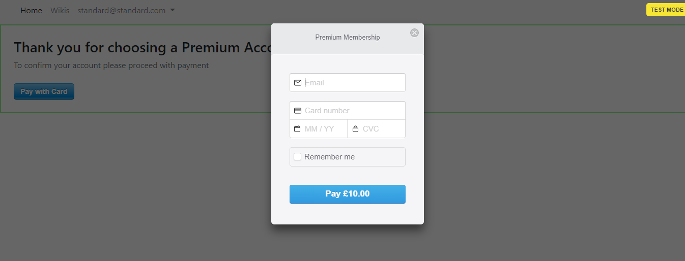

[Visit the Site](https://memorial-notifier-api.herokuapp.com/%20){:target="_blank"} (Note: It is an API, see ReadMe for interaction) 
[Source Code on Git Hub](https://github.com/samibirnbaum/Memorial-Notifier-API){:target="_blank"}

<!-- CASE STUDY HERE -->
<!-- Summary -->
### Summary
<!--    - short and to the point -->
<!--    - starting point >>> outcome -->
This project was my venture into creating an agnostic backend. Arguably how backends should be built.

What you will find is a fully functional Ruby on Rails API, that uses Devise with JWT's for secure authentication. This type of design allows for a robust backend that can be connected to any frontend. This permits a highly flexible frontend. If you prefer Angular, be my guest. React? IOS or Android Application? The choice is yours! 

For a little bit more insight on the build visit my [blog]() on the build.

<!--tech used-->
##### &nbsp;&nbsp;&nbsp;&nbsp;&nbsp;&nbsp; Spec:
&nbsp;&nbsp;&nbsp;&nbsp;&nbsp;&nbsp; HTML(5)  
&nbsp;&nbsp;&nbsp;&nbsp;&nbsp;&nbsp; CSS(3)  
&nbsp;&nbsp;&nbsp;&nbsp;&nbsp;&nbsp; Bootstrap  
&nbsp;&nbsp;&nbsp;&nbsp;&nbsp;&nbsp; JavaScript  
&nbsp;&nbsp;&nbsp;&nbsp;&nbsp;&nbsp; JQuery  
&nbsp;&nbsp;&nbsp;&nbsp;&nbsp;&nbsp; Ruby  
&nbsp;&nbsp;&nbsp;&nbsp;&nbsp;&nbsp; Ruby on Rails  
&nbsp;&nbsp;&nbsp;&nbsp;&nbsp;&nbsp; ERB  
&nbsp;&nbsp;&nbsp;&nbsp;&nbsp;&nbsp; [RSpec](https://rubygems.org/gems/rspec-rails){:target="_blank"}  
&nbsp;&nbsp;&nbsp;&nbsp;&nbsp;&nbsp; [Devise](https://rubygems.org/gems/devise){:target="_blank"}  
&nbsp;&nbsp;&nbsp;&nbsp;&nbsp;&nbsp; [Pundit](https://rubygems.org/gems/pundit){:target="_blank"}  
&nbsp;&nbsp;&nbsp;&nbsp;&nbsp;&nbsp; [Stripe](https://rubygems.org/gems/stripe){:target="_blank"}  
&nbsp;&nbsp;&nbsp;&nbsp;&nbsp;&nbsp; [Red Carpet](https://rubygems.org/gems/redcarpet){:target="_blank"}  
&nbsp;&nbsp;&nbsp;&nbsp;&nbsp;&nbsp; Git & Git Hub  
&nbsp;&nbsp;&nbsp;&nbsp;&nbsp;&nbsp; [Heroku](https://www.heroku.com/){:target="_blank"}

**This is not supposed to be a  finished product** but was part of the learning process of my web development course with [Bloc](https://www.bloc.io/){:target="_blank"} covering core programming topics.

<!-- my role  -->
### My Role
<!--    - backstory, who and why? -->
To create this application as a sole developer, working remotely, completing specific tasks outlined by Bloc.

<!--    - explanation / relationship you had to the project -->
It was time to delve further into the world of backend development. Become more familiar with servers, databases, MVC[1](#MVC), routes and HTTP requests. And overall develop a far more holistic understanding of web applications.

Given my desire get to the bottom of things and understand the inner workings, I found this rather enjoyable, being able to trace and direct a users request all the way from the frontend through to the backend and back out to the frontend again.

I was provided with User Stories [2](#UserStories) that I had to comprehend and complete.
* As a user, I want to sign up for a free account by providing a user name, password and email
* As a user, I want to sign in and out of samipedia
* As a user with a standard account, I want to create, read, update, and delete public wikis	
* As a developer, I want to offer three user roles: admin, standard, or premium	
* As a developer, I want to seed the development database automatically with users and wikis
* As a user, I want to upgrade my account from a free to a paid plan
* As a premium user, I want to create private wikis
* As a user, I want to edit wikis using Markdown syntax
* As a premium user, I want to add and remove collaborators for my private wikis

I derived from these user stories some wireframes for my design of the frontend.

On top of the above I was expected to implement TDD[3](#TDD) using RSpec.

I used Git to maintain a local repository of the project and a remote repository on GitHub, and used feature branches to ensure a smooth workflow and secure version control.

Lastly, I decided to deploy my application on [Heroku](https://www.heroku.com/){:target="_blank"} using their CLI, to further enhance my knowledge of Hosting, DNS and Domain Names. 

<!-- Problems -->

### Problems
<!--    - problems you were hired to solve -->
Building an application of this nature from scratch meant there were numerous tasks and problems that needed to be solved. Given the limited scope of this work I will attempt to name a few to give you an insight into the generic challenges faced and my approach to them.

<!-- list 3 -->
1. &nbsp;Create three different roles a user can have, standard, premium and admin.    
<!--    - -->
2. &nbsp;Use [Stripe](https://rubygems.org/gems/stripe){:target="_blank"} to charge users before switching their account role from standard to premium.  
<!----->
3. &nbsp;Create `_form` partial that contains the form for new/edit action. Then render this partial in 
&nbsp;&nbsp;&nbsp;&nbsp;&nbsp;&nbsp;new and edit views. Too much logic to handle one checkbox. Move the logic to helpers or &nbsp;&nbsp;&nbsp;&nbsp;&nbsp;&nbsp;models. 

<!-- Solutions -->
 
### Solutions
<!--    - -->
1. &nbsp;This would prove to be tricky. Each user would have different permissions depending on their role, so it was important to be able to track a current users role and cater permissions to actions within the controller accordingly.

The relatively easy part would be to establish a users role and persist that information to the database.

I had already created a user model so it just required me to add another column in the model which would hold the details of a users role.


class User < ApplicationRecord
  # Include default devise modules. Others available are:
  # :confirmable, :lockable, :timeoutable and :omniauthable
  devise :database_authenticatable, :registerable, :recoverable, :rememberable, :trackable, :validatable, :confirmable

  #@email
  #@password
  #@load of devise atts
  enum role: [:standard, :premium, :admin]

  has_many :wikis_created, foreign_key: "user_id", class_name: "Wiki", dependent: :destroy
  has_many :collaborators, dependent: :destroy
  has_many :wikis, through: :collaborators

  after_initialize {self.role = :standard if self.role.nil?}
  
end


Two important things I did here, was save the `role` attribute as an `enum`, this provides some handy methods which could be used when on the `current user object` to determine the users role. Moreover, I set the role to be standard by default unless instructed otherwise.

I had now created roles for each user and thanks to the [Devise Gem](https://rubygems.org/gems/devise){:target="_blank"} I had some great helper methods (`current_user`) that would allow me in the views (with my `enum` methods) to determine what role my user occupied.

This just left me with the task of setting up the permissions.

Now technically, I could have simply hidden forms or buttons on the frontend but this would not be as secure as setting permissions on the backend.

In order to achieve this I used a gem called [pundit](https://rubygems.org/gems/pundit){:target="_blank"} to set up policies for my wiki resource.


class WikiPolicy < ApplicationPolicy
    include ActiveModel::Dirty
   
    def create?
        user.admin? || user.premium? || user.standard? && record.private == false
    end
 
    
    def show?
        if user.nil?
            if record.private == false 
                return true
            end
        elsif user
            if user.admin? || user.premium? || user.standard? && record.private == false
                return true
            end
        end
        return false
     end
     
    
    def edit?
        user.admin? || user.premium? || user.standard? && record.private == false
    end

    
    def update?
        if user.admin?
            return true
        elsif user.standard?
            if record.private == true
                return false
            end
        elsif user.premium?
            if record.user == user
                return true
            elsif record.user != user
                if record.private_changed?
                    return false
                end
            end
         end
        return true
    end

    def destroy?
        user.admin? || user.standard? && record.user == user || user.premium? && record.user == user
    end
 end


Great! This worked so all was good to go! (or so I thought...)

Cue a well-needed code review:

>Hi Samuel, 
>good start but please fix following: 
>Try to optimize code in policies. I noticed that generally, your conditionals are much more complex then they should be. 
>After implementing this your code will look much better. 
>Best regards, 
>DI 
>_Bloc Grading Team_

I knew it myself. My logic had become far too complex, difficult for me to comprehend, let alone anyone else and this type of code was too susceptible to bugs as my application scaled up.

Time to refactor:


class WikiPolicy < ApplicationPolicy
    include ActiveModel::Dirty

    def create?
        user.admin? || user.premium? || user.standard? && record.private == false
    end

    def show?
        record.private == false || user.admin? || record.collaborators.where(user: user).any?
    end

    def edit?
        record.private == false || user.admin? || record.collaborators.where(user: user).any?
    end

    def update?
       user.admin? || record.user == user || record.private == false && !record.private_changed? || record.collaborators.where(user: user).any? && !record.private_changed?
    end
 
    def destroy?
        user.admin? || record.user == user
    end


Great, three different user roles, which carry different permissions throughout the application.
   
<!--    - -->
2\. &nbsp; I decided that as well as allowing users to upgrade their account from standard to premium.

I also wanted users to be have the option to sign up for a premium account initially. This meant editing Devise's built-in sign up view.

Additionally I needed to edit Devise's `registrations` controller, so I could redirect a user who opted to sign up for a premium account to the `new charge` view, where I could take a payment through Stripe before changing the role on their account to premium.

class RegistrationsController < Devise::RegistrationsController
    protected

    def after_sign_up_path_for(resource)
        if params[:commit] == "Sign up for Premium Account"
            redirect = new_charge_path
            return redirect if redirect.present?
        else
            redirect = root_path
            return redirect if redirect.present?
        end
    end
end


Now, I could redirect the User to the `new charge` view and allow my `charges controller` to handle the Stripe payment and upgrade the users account accordingly.

The code in the charges controller to facilitate the Stripe payment:


class ChargesController < ApplicationController
    before_action :authenticate_user!
    
    def new
        @stripe_btn_data = {
            key: "#{ Rails.configuration.stripe[:publishable_key] }",
            description: "Premium Membership",
            amount: Amount.default
        }
    end

    def create
        #customer object sent to stripe
        customer = Stripe::Customer.create( #saved to stripe db
        email: current_user.email,
        card: params[:stripeToken]
        )

        #charge object sent to stripe
        charge = Stripe::Charge.create( #saved to stripe db
            customer: customer.id, # Note -- this is NOT the user_id in your app
            amount: Amount.default,
            description: "Premium Membership",
            currency: 'gbp',
            receipt_email: customer.email
        )
        
        #if all goes well
        current_user.premium! #change role to premium
        flash[:notice] = "Thank you, your payment was successful. You are now a Premium Member! An email reciept had been sent. You can now view, create and edit private wikis!"
        redirect_to root_path

        #else
        rescue Stripe::CardError => e
        flash[:alert] = e.message
        redirect_to new_charge_path
    end
end


(I used a Ruby Gem called [Figaro](https://github.com/laserlemon/figaro){:target="_blank"} to keep any sensitive information such as `STRIPE_PUBLISHABLE_KEY:` secure)

Cue praise&nbsp;&nbsp; :grinning:

>Awesome job. I like how you've used tooltips and the dropdown menu. Everything works great including your signup for premium and pay right away.  
>Seems like if you don't pay it still allows you to see the title of the Private wikis but once you click into one it won't let you see it and tells you that you need to upgrade.  
>I like that as its a way to get people to upgrade. 
>Nice work. 
>Matt 
>_Bloc Grading Team_

  
<!-- - -->
3\. &nbsp; At this stage I had reached the end of the project and I had the site up and running with no bugs detected. However, my views were not as slim as they should be. Moreover, they contained too much logic, I needed a way to tidy this all up.

The main areas of concern were the `new` and `edit` views for wikis:


<!-- NEW VIEW -->
<h1 align="center">Create a New Wiki</h1>
 

    <%= form_for(@wiki) do |f| %>
        

            <%= f.label (:title) %>
            <%= f.text_field (:title), class: "form-control form-control-lg", autofocus: true %>
        
    
        
        

            <%= f.label (:body) %>
            <%= f.text_area (:body), class: "form-control", rows: 12 %>
        

        
        
        

           <%= f.check_box (:private), class: "form-check-input", disabled: current_user.standard? ? true : false %>
            <%if current_user.standard?%>
                <input type="hidden" id="wiki_private" name="wiki[private]" value="0"/>
            <%end%>
            <%= f.label (:private), class: "form-check-label" %>
            <small class="form-text text-muted">Only Premium Users can create private wikis</small>
        

        
        

            <%= f.submit ("Create"), class: "btn btn-success btn-lg" %>
        

    <% end %>




<!-- EDIT VIEW -->
<h1 align="center">Edit Wiki</h1>
 

    <%= form_for(@wiki) do |f| %>
        

            <%= f.label (:title) %>
            <%= f.text_field (:title), class: "form-control form-control-lg"%>
        
    
        
        

            <%= f.label (:body) %>
            <%= f.text_area (:body), class: "form-control", rows: 12 %>
        

        
        <% if current_user.standard? && @wiki.collaborators.where(user: current_user)[0] == nil %>
            

                <%= f.check_box (:private), class: "form-check-input", disabled: true%>
                <input type="hidden" id="wiki_private" name="wiki[private]" value="0"/>
                <%= f.label (:private), class: "form-check-label" %>
                <small class="form-text text-muted">Only Premium Users can privatize wikis</small>
            

        <%elsif current_user.premium? && @wiki.user != current_user || @wiki.collaborators.where(user: current_user)[0].user == current_user && @wiki.user != current_user %>
            

                <%= f.check_box (:private), class: "form-check-input", disabled: true%>
                <%if @wiki.private == true%>
                    <input type="hidden" id="wiki_private" name="wiki[private]" value="1"/>
                <%else%>
                    <input type="hidden" id="wiki_private" name="wiki[private]" value="0"/>
                <%end%>
                <%= f.label (:private), class: "form-check-label" %>
                <small class="form-text text-muted">You can only change private status of your own wiki</small>
            

        <%else%>
            

                <%= f.check_box (:private), class: "form-check-input"%>
                <%= f.label (:private), class: "form-check-label" %>
                <small class="form-text text-muted">You can only change private status of your own wiki</small>
            

        <%end%>
        
        

            <%= f.submit ("Update"), class: "btn btn-success btn-lg" %>
        

    <% end %>

     <!--code left out for brevity-->

 



By moving the form to a partial I was able to slim down both these views significantly


<!-- NEW VIEW -->
<h1 align="center">Create a New Wiki</h1>
 

    <%= render partial: "form", locals: {wiki: @wiki, submit_text: "Create"} %>




<!-- EDIT VIEW -->
<h1 align="center">Edit Wiki</h1>
 

    <%= render partial: "form", locals: {wiki: @wiki, submit_text: "Update"} %>
<!--code left out for brevity-->



Lastly, in order to handle the logic surrounding the checkbox on the form, I created another partial for the checkbox itself, which was called from inside the form partial, this kept the form partial slim:


<%= form_for(wiki) do |f| %>
        

            <%= f.label (:title) %>
            <%= f.text_field (:title), class: "form-control form-control-lg", autofocus: true %>
        
    
        
        

            <%= f.label (:body) %>
            <%= f.text_area (:body), class: "form-control", rows: 12 %>
        

        
        
        

            <%= render partial: "checkbox", locals: {wiki: wiki, f: f} %> <!--call to the checkbox partial-->
        

        
        

            <%= f.submit (submit_text), class: "btn btn-success btn-lg" %>
        

    <% end %>


I then slimmed down the logic for the checkbox in the checkbox partial:

<!-- 4 Scenarios
1. new wiki checkbox for standard users (no access)
2. new wiki chheckbox for other users (yes access)
3. edit wiki checkbox for owners (yes access)
4. edit wiki checkbox for non owners (no access)

If very neccessary these could be combined to two scenarios, no access and yes access -->

<%if current_user.standard? && wiki.created_at.nil?%>
    <%= f.check_box (:private), class: "form-check-input", disabled: true%>
    <input type="hidden" id="wiki_private" name="wiki[private]" value="0"/>
    <%= f.label (:private), class: "form-check-label" %>
    <small class="form-text text-muted">Only Premium Users can create private wikis</small>
<%elsif wiki.created_at.nil?%>
    <%= f.check_box (:private), class: "form-check-input"%>
    <%= f.label (:private), class: "form-check-label" %>
    <small class="form-text text-muted">Only Premium Users can create private wikis</small>
<%elsif current_user.admin? || @wiki.user == current_user && current_user.premium?%>
    <%= f.check_box (:private), class: "form-check-input"%>
    <%= f.label (:private), class: "form-check-label" %>
    <small class="form-text text-muted">You can only change private status of your own wiki</small>
<%else%>
    <%= f.check_box (:private), class: "form-check-input", disabled: true%>
    <%if @wiki.private == true%>
        <input type="hidden" id="wiki_private" name="wiki[private]" value="1"/>
    <%else%>
        <input type="hidden" id="wiki_private" name="wiki[private]" value="0"/>
    <%end%>
    <%= f.label (:private), class: "form-check-label" %>
    <small class="form-text text-muted">You can only change private status of your own wiki</small>
<%end%>


**Note:** These were not necessarily the hardest problems or challenges faced when building this application, for more complex functionality please feel free to look over the [source code on Git Hub](https://github.com/samibirnbaum/samipedia){:target="_blank"}. However, the idea is that you can get a feel for some of the problems and my systematic approach to them.
  
<!--    - -->

<!-- Results -->

### Results
<!--    - how you tested -->
My main form of testing for my rails application was using RSpec(150+ tests). This helped me to catch any bugs far quicker and meant I didn't need to be overly concerned when refactoring my code or changing other features in the application. I also tested things using `IRB`, the `rails console` and [Byebug](https://github.com/deivid-rodriguez/byebug){:target="_blank"}, which proved invaluable.  
<!--    - did you get desired outcome -->

I was able to achieve the desired outcomes of the course project and more importantly I was really able to further my understanding of Ruby on Rails and all the accompanying technologies, RVM, RSpec, servers, HTTP Requests, Ruby Gems, Params etc... 
  
<!--    - others reviews -->
Feedback from my codementor was positive.

<!-- Conclusion -->

### Conclusion
<!--    - What were your doubts going into the project? -->
I was really being challenged with this project to use my own initiative and external resources right from the get go. There was minimal guidance from Bloc as this was the second project I was undertaking using Ruby on Rails. Consequently, I was apprehensive about my own ability to achieve the desired outcomes.
<!--    - What surprised you the most? -->

However, in some respects this allowed me to learn and grow the most. I began to access the wider rails community, forums, stack overflow, ruby gems, documentation. With every successful feature or code snippet my confidence began to grow and this helped me to become more creative and pursue my own ideas of how I felt the code should function and the project should look. This was empowering but also more enjoyable for me as I felt I could take ownership of the project.  
<!--    - What would you have done differently? -->
<!--    - What did you learn while doing this project? -->
The biggest and most valuable learning curve whilst undertaking this project, was by far the power of refactoring. Initially, I was slightly perturbed by the code review that I had to undertake (even though I knew it must be done). I had got to a stage where my code felt disorganised and like an unstable lego tower, it was currently upright but I didn't want to touch anything at the risk of something breaking. However, what I learnt was that after a good nights sleep, you can achieve so much by going over your code, trying to slim it down, reassessing the logic, and as a result of this, my code would develop less bugs, be scalable and easier for other developers to reason with. 

<!--    - How will you use that information in the future? -->
Going forward, this experience of refactoring code that initially I didn't want to touch, will give me confidence in the future to refactor and reap the rewards. Furthermore, when writing code initially, I intend to be more aware of the potential disorganisation that can occur as the code base increases, and try keep my code more organised and structured so I dont run into problems when the application grows at a later stage.

       

<a name="MVC">1</a>: The Model-View-Controller (MVC) is an architectural pattern that separates an application into three main logical components: the model, the view, and the controller. Each of these components are built to handle specific development aspects of an application.[↩](#a1)

<a name="UserStories">2</a>: A user story is a tool used in Agile software development to capture a description of a software feature from an end-user perspective. The user story describes the type of user, what they want and why. A user story helps to create a simplified description of a requirement.[↩](#a2)

<a name="TDD">3</a>: Test-driven development (TDD) is a development technique where you must first write a test that fails before you write new functional code.[↩](#a3)

*[CLI]: Command Line Interface
*[CRUD]: Create Read Update Delete

<!-- Code Blocks: -->







