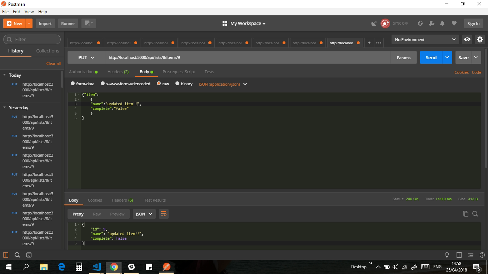

[Source Code on Git Hub](https://github.com/samibirnbaum/to-do-list-api){:target="_blank"}

<!-- CASE STUDY HERE -->
<!-- Summary -->
### Summary
<!--    - short and to the point -->
<!--    - starting point >>> outcome -->
An externally usable API for a basic to-do list application built using Rails 5.0 API Mode.

Welcome to my to-do-list-api, an API that allows users to modify user accounts and to-do items from the command line.

This is something I've wanted to jump into for a long time. Using Rails 5.0 to build an API would further develop my backend skills, and in my opinion build a backend how it should be built, entirely separate from the frontend and fully agnostic.

<!--tech used-->
##### &nbsp;&nbsp;&nbsp;&nbsp;&nbsp;&nbsp; Spec:
&nbsp;&nbsp;&nbsp;&nbsp;&nbsp;&nbsp; Ruby  
&nbsp;&nbsp;&nbsp;&nbsp;&nbsp;&nbsp; Ruby on Rails  
&nbsp;&nbsp;&nbsp;&nbsp;&nbsp;&nbsp; JSON  
&nbsp;&nbsp;&nbsp;&nbsp;&nbsp;&nbsp; [Active Model Serializers](https://rubygems.org/gems/active_model_serializers){:target="_blank"}  
&nbsp;&nbsp;&nbsp;&nbsp;&nbsp;&nbsp; [RSpec](https://rubygems.org/gems/rspec-rails){:target="_blank"}  
&nbsp;&nbsp;&nbsp;&nbsp;&nbsp;&nbsp; [Byebug](https://rubygems.org/gems/byebug){:target="_blank"}  
&nbsp;&nbsp;&nbsp;&nbsp;&nbsp;&nbsp; [Factory Bot](https://rubygems.org/gems/factory_bot_rails){:target="_blank"}  
&nbsp;&nbsp;&nbsp;&nbsp;&nbsp;&nbsp; [Faker](https://rubygems.org/gems/faker){:target="_blank"}  
&nbsp;&nbsp;&nbsp;&nbsp;&nbsp;&nbsp; [Postman](https://www.getpostman.com/){:target="_blank"}  
&nbsp;&nbsp;&nbsp;&nbsp;&nbsp;&nbsp; Git & Git Hub  

**This is not supposed to be a  finished product** but was part of the learning process of my web development course with [Bloc](https://www.bloc.io/){:target="_blank"} covering core programming topics.

<!-- my role  -->
### My Role
<!--    - backstory, who and why? -->
To create this application as a sole developer, working remotely, completing specific tasks outlined by Bloc.

<!--    - explanation / relationship you had to the project -->
It was time to delve further into the world of backend development. Become more familiar with servers, databases, MVC[1](#MVC), routes, JSON, API's and HTTP requests. And overall develop a far more holistic understanding of web applications.

I was provided with User Stories [2](#UserStories) that I had to comprehend and complete.
* As a user, I want the To-do API, to return JSON representations of users, lists, and items
* As a user, I want to authenticate myself from the command line, using a username and &nbsp;&nbsp;&nbsp;&nbsp;&nbsp;&nbsp;&nbsp;password
* As a user, I want to create new users, lists, and items from the command line
* As a user, I want to remove users and lists from the command line
* As a user, I want to update list and item attributes from the command line

I used these User Stories to map out the workings of the backend.

On top of the above I was expected to implement TDD[3](#TDD) using RSpec.

I used Git to maintain a local repository of the project and a remote repository on GitHub, and used feature branches to ensure a smooth workflow and secure version control.

<!-- Problems -->

### Problems
<!--    - problems you were hired to solve -->
<!-- list 3 -->
1. &nbsp;When the API returns the desired data, it returns _all_ the data, some of which is sensitive.    
<!--    - -->
2. &nbsp;Allow users to authenticate with the API.  
<!----->
3. &nbsp;Give the user the ability to update items using the api. 

<!-- Solutions -->
 
### Solutions
<!--    - -->
1. &nbsp; I needed a way to filter the JSON that was being sent to the user in the response body. For example, if the user requested to see all users in the databse, this should only return the username and email and not the password.

It was time to leverage the power of a Ruby Gem called [Active Model Serializers](https://rubygems.org/gems/active_model_serializers){:target="_blank"}.

Using relatively simple code I could ensure for all my objects that only certain data would be returned.


class UserSerializer < ActiveModel::Serializer
  attributes :id, :username, :email
end



class ListSerializer < ActiveModel::Serializer
  attributes :id, :name, :private
end



class ItemSerializer < ActiveModel::Serializer
  attributes :id, :name, :complete
end


Now in my controller when I would render the JSON of an object which shared the same name as a Serializer:

def index
    @users = User.all.reverse
    render json: @users, each_serializer: UserSerializer
end

the JSON being returned would automatically be filtered according to my preferences.

   
<!--    - -->
2\. &nbsp; This was far more tricky than it seemed. 

I had built authentication systems before, one without any helper gems and one using a great little gem called Devise. However, when it comes to API's, Rails standard format for authentication runs into some issues.

As far as my understanding goes, this is based around the problem of CSRF[4](#CSRF) attacks. A standard non-API rails projects handles this well by obtaining the users session token from the HTML. This means that only someone who is physically making a request from the sites view will be authenticated and not a hacker from another computer.

However, this is an API, so our users wouldn't have any HTML and thus would always fail this form of authentication.

In fact in Rails API mode this default form of authentication `:verify_authenticity_token` is already turned off.

Time to build our own form of authentication:


class ApiController < ApplicationController
    #dont want to use rails default csrf session system because we wont have token in the html
    #automatically not included in rails api mode
    # skip_before_action :verify_authenticity_token 

    #we will create our own authentication for users
    private
    def authenticated?
        #there is no session every http request the user has to authenticate again - stateless http
        #the method below will obtain the username and password and see if it exists in the database
        authenticate_or_request_with_http_basic{|username, password| User.where( username: username, password: password).present? }
        #note the password in the database would normally be hashed so would have to work with that
    end
end


In every controller I simply added the line:


before_action :authenticated?


With every request made to the API a user would have to authenticate with their own username and password. Arguably, this doesn't offer the most user-friendly access, but it does ensure better security.

  
<!-- - -->
3\. &nbsp; Requests and Responses are the life blood of any backend application. 

I first created a route to allow access to the relevant resource through an HTTP request.


resources :lists, only: [] do
      resources :items, only: [:create, :update]
end

# PUT    /api/lists/:list_id/items/:id(.:format)       api/items#update {:format=>:json}


Before I wrote the `update` method, I wrote my tests inline with TDD.

 describe 'PUT #update' do
        context 'without authentication' do
            it 'returns unathorised error' do
                create(:item)
                put :update, params: {item: {name: "updated item", complete: true}, list_id: 1, id: 1}
                expect(response).to have_http_status(401)
            end
        end
        context 'with authentication' do
            before do
                create(:item)
                request.env['HTTP_AUTHORIZATION'] = ActionController::HttpAuthentication::Basic.encode_credentials("SamiB","password")
            end
            it 'assigns new data to retrieved item object' do
                put :update, params: {item: {name: "updated item", complete: true}, list_id: 1, id: 1}
                expect(assigns(:item).name).to eq("updated item")
                expect(assigns(:item).complete).to eq(true)
                expect(assigns(:item).id).to eq(1)
            end
            it 'updates item in the database' do
                put :update, params: {item: {name: "updated item", complete: true}, list_id: 1, id: 1}
                expect(Item.first.name).to eq("updated item")
            end
            it 'returns json of updated item' do
                put :update, params: {item: {name: "updated item", complete: true}, list_id: 1, id: 1}
                json = JSON.parse(response.body)
                expect(json["name"]).to eq("updated item")
                expect(json["list_id"]).to be_nil
            end
            it 'returns 422 if data invalid' do
                put :update, params: {item: {name: "", complete: ""}, list_id: 1, id: 1}
                expect(response).to have_http_status(422)
            end
        end
    end


Now time to write the actual method:


def update
        @item = Item.find(params["id"])
        @item.name = params["item"]["name"]
        @item.complete = params["item"]["complete"]

        if @item.save
            render json: @item            
        else
            render json: { errors: @item.errors.full_messages }, status: :unprocessable_entity
        end
    end


Great all my tests were passing, so for my own gratification I could now actually make the HTTP request using a really great platform called Postman.




And there you have it, the ability to update items using the API.

**Note:** These were not necessarily the hardest problems or challenges faced when building this application, for more complex functionality please feel free to look over the [source code on Git Hub](https://github.com/samibirnbaum/to-do-list-api){:target="_blank"}. However, the idea is that you can get a feel for some of the problems and my systematic approach to them.
  
<!--    - -->

<!-- Results -->

### Results
<!--    - how you tested -->
My main form of testing for my rails API was using RSpec. This helped me to catch any bugs far quicker and meant I didn't need to be overly concerned when refactoring my code or changing other features in the application. I also tested things using `IRB`, the `rails console` and [Byebug](https://github.com/deivid-rodriguez/byebug){:target="_blank"}, which proved invaluable.  
<!--    - did you get desired outcome -->

I was able to achieve the desired outcomes of the course project and more importantly I was really able to further my understanding of Ruby on Rails and all the accompanying technologies, RVM, RSpec, servers, HTTP Requests, Ruby Gems, Params etc... 
  
<!--    - others reviews -->
Feedback from my codementor was positive.

<!-- Conclusion -->

### Conclusion
<!--    - What were your doubts going into the project? -->
Going into this project, I was doubtful over the ability to get to grips with the workings of an API, especially as this was real backend work without any views (unlike a standard rails project where you do have views).
<!--    - What surprised you the most? -->

However, although it took me time to get my head around this, it just feels like the right way to have a backend functioning. It makes the frontend far more flexible and allows the backend to be truly agnostic.  
<!--    - What would you have done differently? -->
Looking back, this was a great start for getting to grips with the general make up of an API. However, I would like to have understood more about user sessions and authentication, to have this set up in a more user-friendly way. Moreover, I would like to actually have a frontend which connects to the API, just to give me a better feel of the entire full-stack process.

<!--    - What did you learn while doing this project? -->
Having said this, one of the most valuable things I learnt from this project was getting a better understanding of JSON, API's and how Rails works under the hood. This project forced me to play around with HTTP requests and especially the `params hash` which rails utilises. 

<!--    - How will you use that information in the future? -->
Going forward, it would be great to develop more complex and robust API's. I would really like to become more comfortable with this form of development and actually deploy an API, and then go on to build a frontend to interact with this API. Personally, I feel it makes sense to build out applications this way because it allows far more flexibility on the frontend side of these things. Although, admittedly it is harder work than just doing it all in rails with rails views.

       

<a name="MVC">1</a>: The Model-View-Controller (MVC) is an architectural pattern that separates an application into three main logical components: the model, the view, and the controller. Each of these components are built to handle specific development aspects of an application.[↩](#a1)

<a name="UserStories">2</a>: A user story is a tool used in Agile software development to capture a description of a software feature from an end-user perspective. The user story describes the type of user, what they want and why. A user story helps to create a simplified description of a requirement.[↩](#a2)

<a name="TDD">3</a>: Test-driven development (TDD) is a development technique where you must first write a test that fails before you write new functional code.[↩](#a3)

<a name="CSRF">4</a>: Cross-Site Request Forgery (CSRF) is an attack that forces an end user to execute unwanted actions on a web application in which they're currently authenticated. CSRF attacks specifically target state-changing requests, not theft of data, since the attacker has no way to see the response to the forged request.[↩](#a4)

*[CLI]: Command Line Interface
*[CRUD]: Create Read Update Delete

<!-- Code Blocks: -->







